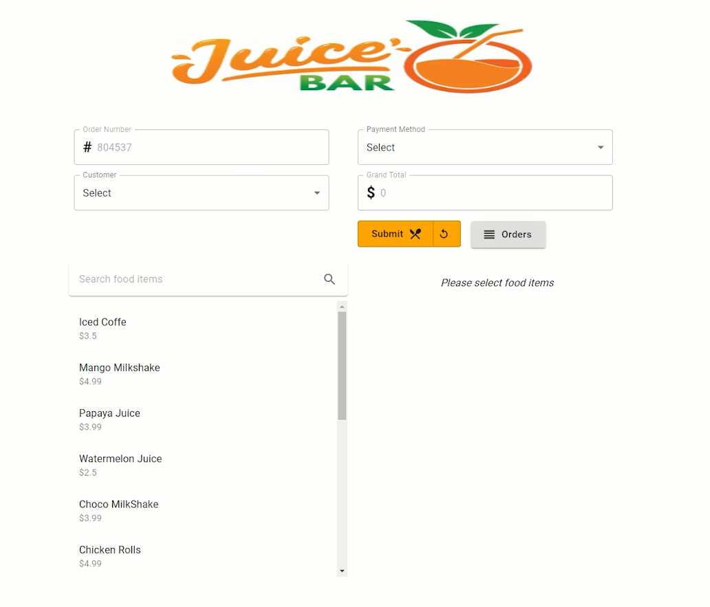

# Restaurant Management System Frontend Setup Instructions

<p align="center">
  
</p>
<br>
Demo : https://youtu.be/F4qPKMhbDEw?si=T_UvjkeXKWgeqLOw
<br>
<br>

## Demo
Watch the demo [here](https://youtu.be/F4qPKMhbDEw?si=T_UvjkeXKWgeqLOw)

Follow these steps to set up and run the Restaurant Management System Frontend:


1. **Navigate to the restaurant-app folder:**
    ```bash
    cd restaurant-app
    ```

2. **Update the backend port in the startup class:**
    - Open the relevant file (e.g., `Startup.cs`).
    - Modify the base URL:
      ```csharp
      app.UseCors(options => options.WithOrigins("http://localhost:3000"));
      ```

3. **Install Material-UI:**
    ```bash
    npm install @material-ui/core
    ```

4. **Copy and paste Material-UI icon codes into your components.**
    - For example:
      ```javascript
      import ReorderIcon from '@mui/icons-material/Reorder';
      ```

5. **Install Axios for API calls:**
    ```bash
    npm install axios
    ```

6. **Update API calls with the backend running URL:**
    - Copy and paste the base URL into your API folder.
    - Update API calls with the backend running URL.
      ```javascript
      const baseURL = 'http://localhost:53688/';
      ```

## Running the Application

To run the application, execute the following command:
```bash
npm start


